# Atlas GTM Data Flow Architecture

> **Last Updated**: 2026-01-20
> **Version**: 1.1
> **Status**: Active - Meeting Prep Agent complete

---

## Table of Contents

1. [Implementation Status](#implementation-status)
2. [System Overview](#system-overview)
3. [Overview Flow Diagram](#overview-flow-diagram)
4. [Agent Communication Overview](#agent-communication-overview)
5. [Lead Scorer Flow](#lead-scorer-flow)
6. [Reply Handler Flow](#reply-handler-flow)
7. [Meeting Prep Agent Flow](#meeting-prep-agent-flow)
8. [Brain Lifecycle Flow](#brain-lifecycle-flow)
9. [Component Architecture](#component-architecture)
10. [Glossary](#glossary)
11. [Change Log](#change-log)

---

## Implementation Status

> **Legend**: ✅ Implemented | 🚧 In Progress | 📋 Planned

### Agents

| Component | Status | Branch/PR | Notes |
|-----------|--------|-----------|-------|
| Lead Scorer Agent | ✅ | `004-lead-scorer` | Scoring, tiers, angles, Slack notifications |
| Reply Handler Agent | ✅ | `006-reply-handler-agent` | Classification, KB matching, tier routing |
| Meeting Prep Agent | ✅ | `008-meeting-prep-agent` | Pre-call briefs, post-call analysis, Slack delivery |

### MCP Servers

| Component | Status | Branch/PR | Notes |
|-----------|--------|-----------|-------|
| Qdrant MCP | ✅ | `002-qdrant-mcp` | KB queries, brain management |
| Brain Lifecycle | ✅ | `003-brain-lifecycle` | Create, seed, activate brains |
| Attio MCP | ✅ | `007-attio-mcp-server` | CRM operations, pipeline management |
| MCP REST API | ✅ | `008-meeting-prep-agent` | HTTP wrapper for MCP tools (:8100) |
| Instantly MCP | 📋 | - | Email campaign integration |
| LinkedIn MCP | 📋 | - | LinkedIn automation |

### Infrastructure

| Component | Status | Branch/PR | Notes |
|-----------|--------|-----------|-------|
| Qdrant + Docker | ✅ | `001-gtm-infra` | Vector DB, 7 collections |
| n8n Workflows | ✅ | `001-gtm-infra` | Batch triggers, webhooks |
| State Management | ✅ | `004-lead-scorer` | JSON checkpoint files |

---

## System Overview

Atlas GTM is an AI-first GTM Operations System that uses swappable "brains" (vertical-specific knowledge bases) to enable rapid market validation. The core concept: **same agents, different brains** for rapid multi-vertical market validation.

### Key Architectural Patterns

1. **Brain-Scoped Queries**: Every KB query MUST include `brain_id` filter
2. **Tier-Based Routing**: Leads/replies routed to Tier 1 (auto), Tier 2 (approval), or Tier 3 (human)
3. **MCP Tool Integration**: Agents use MCP servers for external integrations
4. **State Persistence**: Long-running operations checkpoint to state files

---

## Overview Flow Diagram

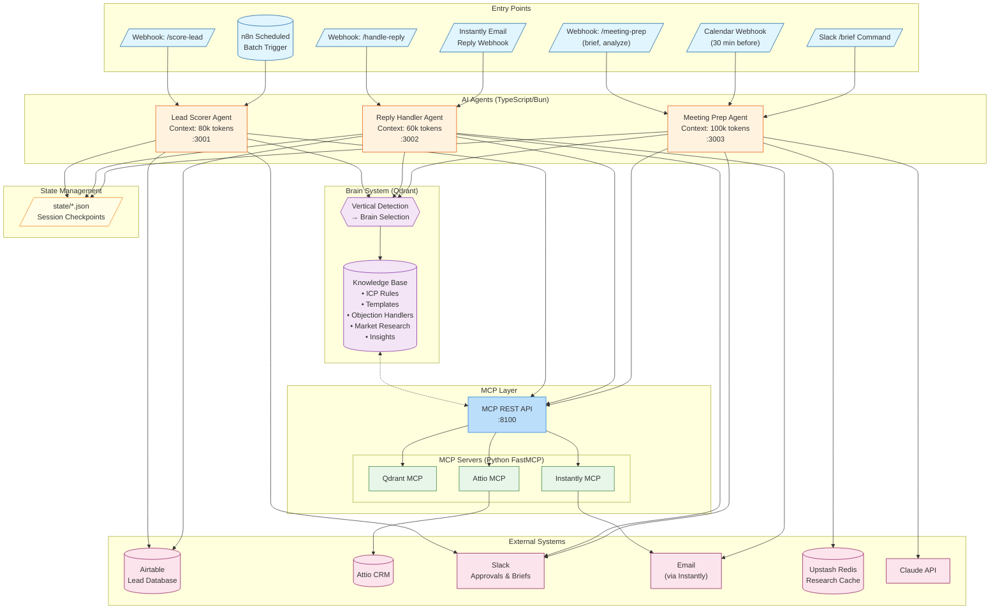

### Data Flow Summary

| Path | Description | Volume |
|------|-------------|--------|
| Webhook → Lead Scorer → KB → Airtable/Slack | Single lead scoring | ~100-500/day |
| n8n Schedule → Lead Scorer → Batch Processing | Batch lead scoring | 50-100 per batch |
| Instantly → Reply Handler → KB → Auto/Approval/Escalate | Reply processing | 100-500 replies/day |
| Calendar → Meeting Prep → Brief → Slack | Pre-call brief generation | 5-20/day |
| Transcript → Meeting Prep → Analysis → CRM | Post-call analysis with BANT | 5-20/day |

---

## Agent Communication Overview

This section shows the unified architecture across all three agents, demonstrating how they share infrastructure while maintaining distinct responsibilities.

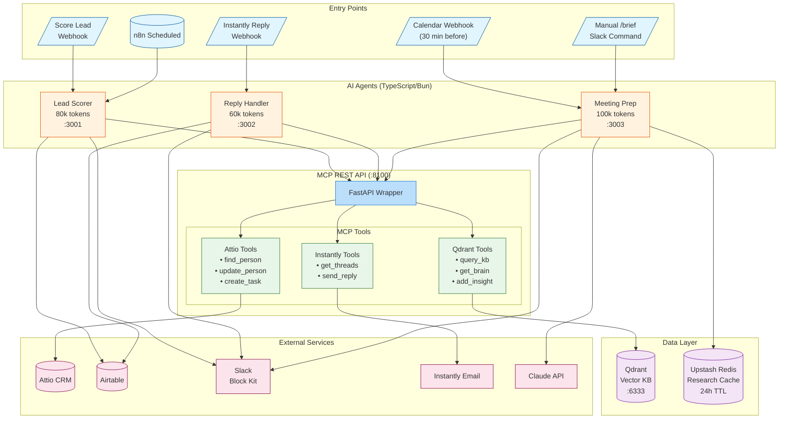

### Agent Responsibilities Matrix

| Agent | Primary Function | Context Budget | Key Outputs |
|-------|-----------------|----------------|-------------|
| **Lead Scorer** | Score leads against ICP rules | 80k tokens | Score, tier, messaging angle |
| **Reply Handler** | Classify & respond to emails | 60k tokens | Auto-reply, approval request, escalation |
| **Meeting Prep** | Pre-call briefs & post-call analysis | 100k tokens | Slack brief, BANT score, CRM updates |

### Shared Infrastructure

All agents share:
- **MCP REST API** (:8100) - HTTP wrapper for tool access
- **Qdrant KB** - Brain-scoped knowledge base queries
- **State files** - Session checkpoints for resumability
- **Slack delivery** - Consistent Block Kit formatting

---

## Lead Scorer Flow

### Sequence Diagram

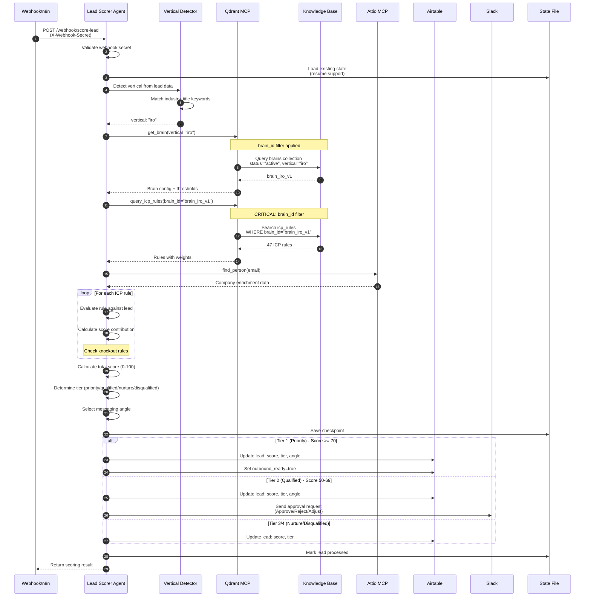

### Key Components

| Component | Responsibility |
|-----------|---------------|
| **Vertical Detector** | Analyzes lead data (industry, title, tech stack) to determine vertical |
| **Brain Loader** | Retrieves active brain config for the detected vertical |
| **ICP Rule Engine** | Evaluates lead against all brain-scoped rules |
| **Tier Calculator** | Converts raw score to tier using brain thresholds |
| **Angle Recommender** | Selects messaging angle based on top signals |

### Scoring Flow Detail

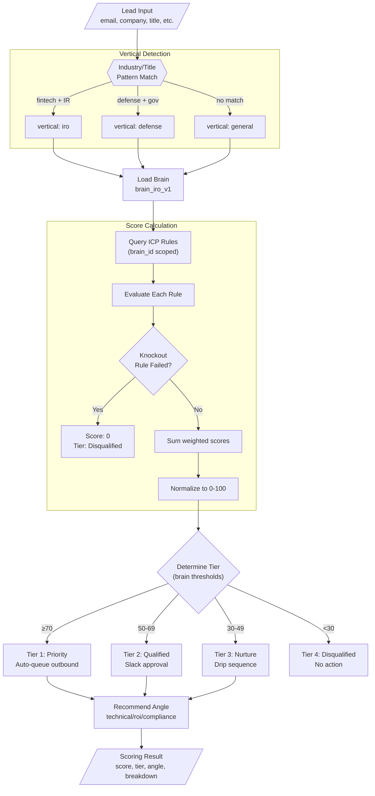

---

## Reply Handler Flow

### Sequence Diagram

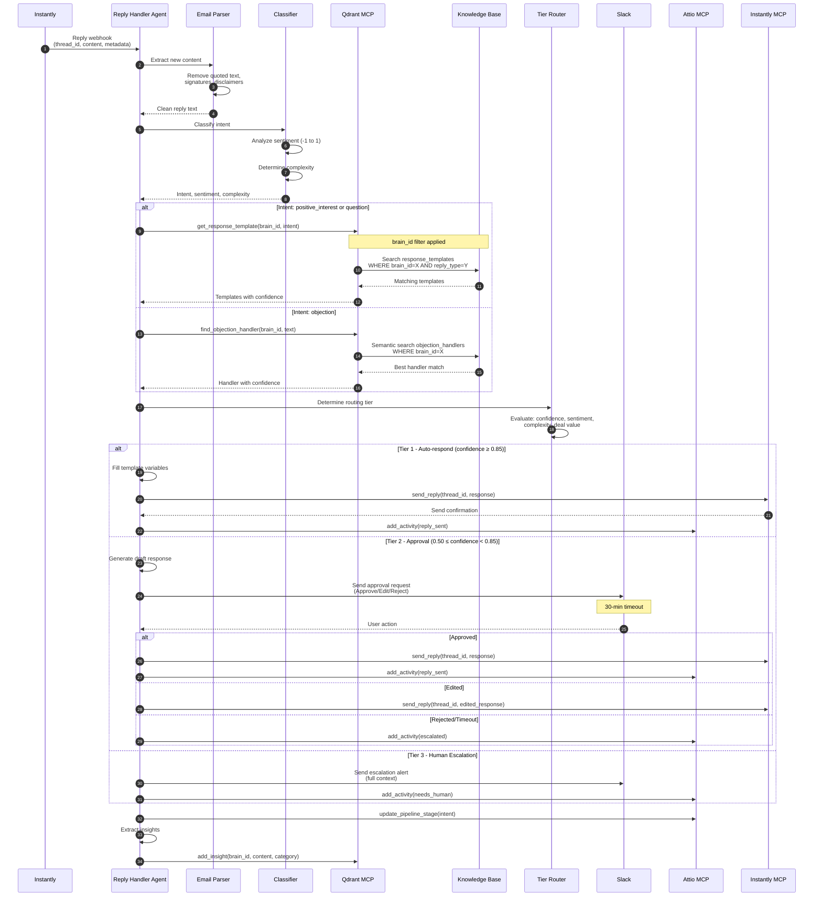

### Tier Routing Logic

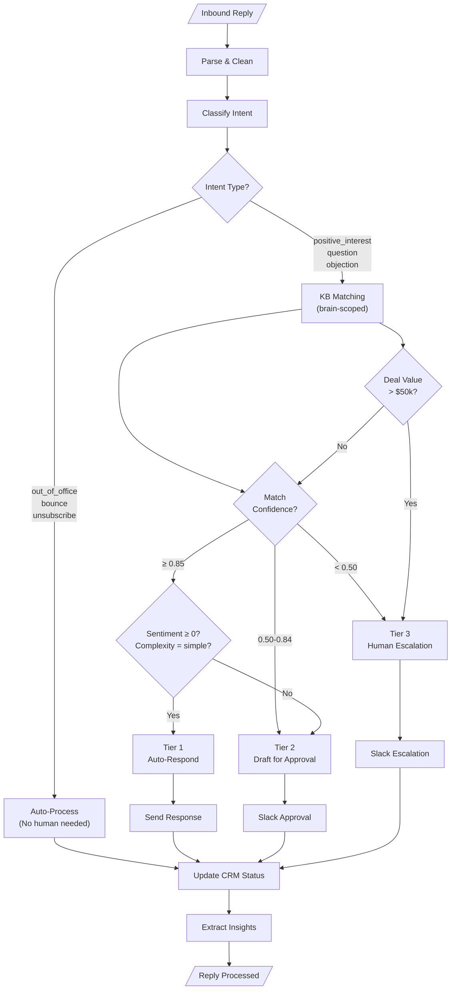

### Intent Classification

| Intent | Description | Typical Tier |
|--------|-------------|--------------|
| `positive_interest` | Wants to learn more, schedule call | 1 |
| `question` | Asks about pricing, features, timeline | 1-2 |
| `objection` | Budget, timing, competitor concerns | 2-3 |
| `referral` | Wrong person, referring elsewhere | 1 |
| `out_of_office` | Auto-reply | Auto |
| `bounce` | Invalid email | Auto |
| `unsubscribe` | Opt out request | Auto |
| `not_interested` | Explicit rejection | Auto |
| `unclear` | Cannot determine intent | 3 |

---

## Meeting Prep Agent Flow

The Meeting Prep Agent generates pre-call briefs 30 minutes before scheduled meetings and performs post-call analysis on transcripts. It uses a modular sub-agent architecture for parallel data gathering.

### Brief Generation Sequence Diagram

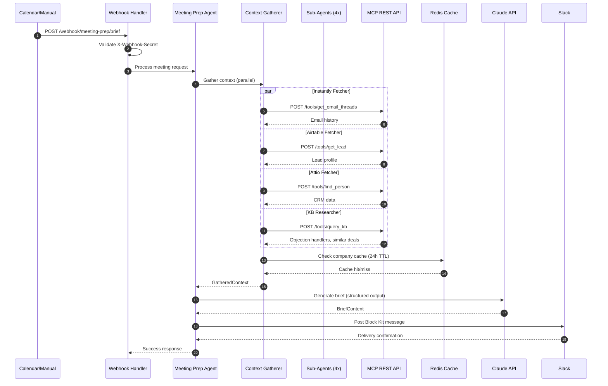

### Post-Meeting Analysis Flow

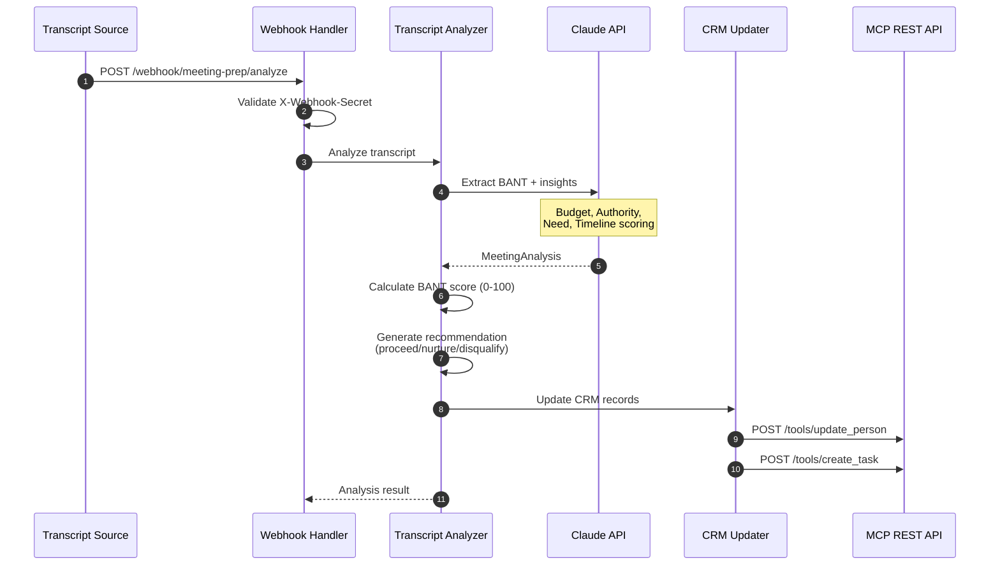

### Brief Content Structure

The pre-call brief includes:

| Section | Content | Source |
|---------|---------|--------|
| **Lead Summary** | Name, company, role, ICP score | Airtable, Lead Scorer |
| **Conversation History** | Recent email threads, sentiment | Instantly |
| **Company Context** | Size, industry, tech stack | Attio, Research cache |
| **Similar Deals** | Past wins with similar profiles | KB (brain-scoped) |
| **Objection Prep** | Likely concerns + handler strategies | KB (brain-scoped) |
| **Suggested Agenda** | Talking points, questions to ask | Claude-generated |

### BANT Scoring

| Dimension | Weight | Signals |
|-----------|--------|---------|
| **Budget** | 25% | Explicit budget mention, funding status, org size |
| **Authority** | 25% | Decision-maker role, buying process clarity |
| **Need** | 25% | Pain point urgency, timeline pressure, current solution gaps |
| **Timeline** | 25% | Explicit dates, urgency language, project deadlines |

### Key Components

| Component | Responsibility |
|-----------|---------------|
| **Webhook Handler** | HTTP entry point, secret validation, request routing |
| **Context Gatherer** | Parallel sub-agent orchestration, cache management |
| **Brief Generator** | Claude-powered brief synthesis from gathered context |
| **Transcript Analyzer** | BANT extraction, scoring, recommendation generation |
| **Slack Delivery** | Block Kit formatting, channel routing |
| **CRM Updater** | Attio sync after analysis |

### Error Handling

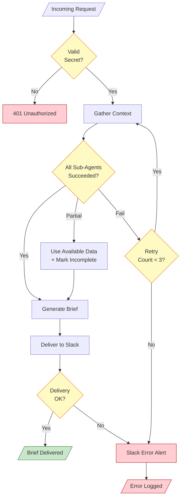

---

## Brain Lifecycle Flow

### Sequence Diagram

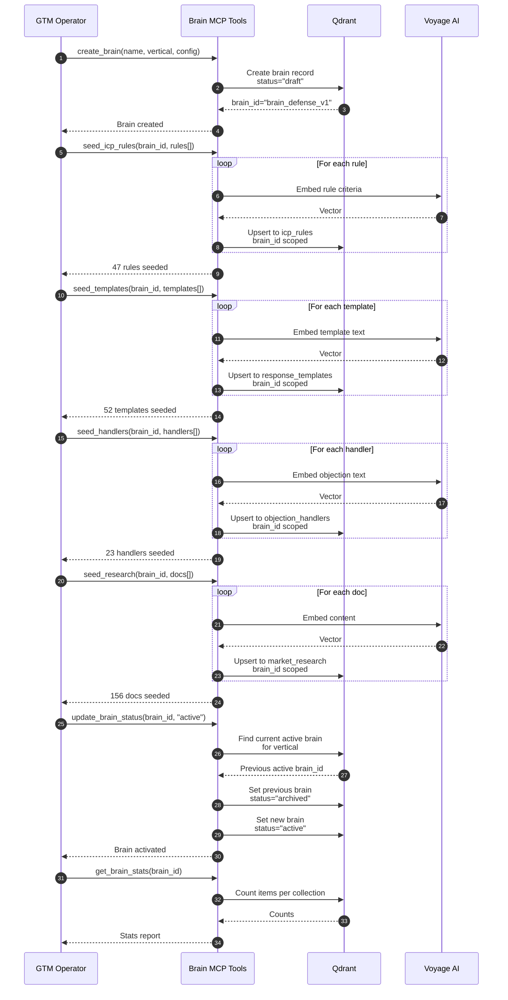

### Brain State Machine

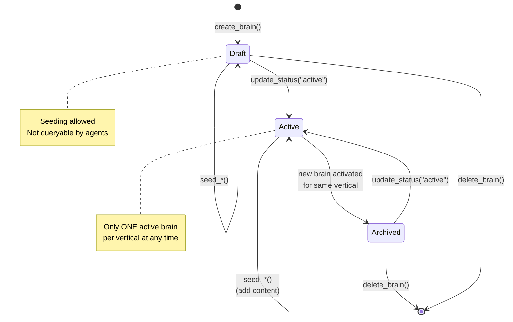

### Brain Collections Structure

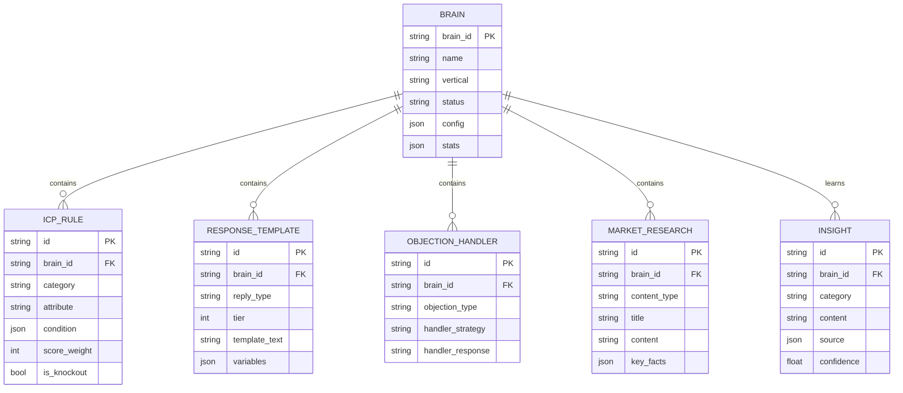

---

## Component Architecture

### System Components

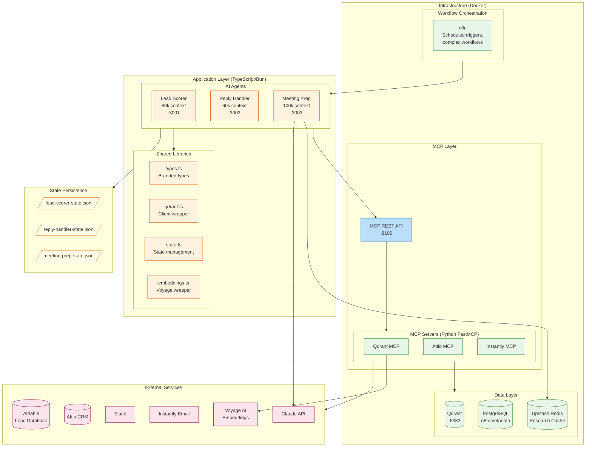

### MCP Server Topology

> **Decision**: Custom MCP servers over Composio - see [ADR-002](../adr/002-composio-mcp-decision.md)

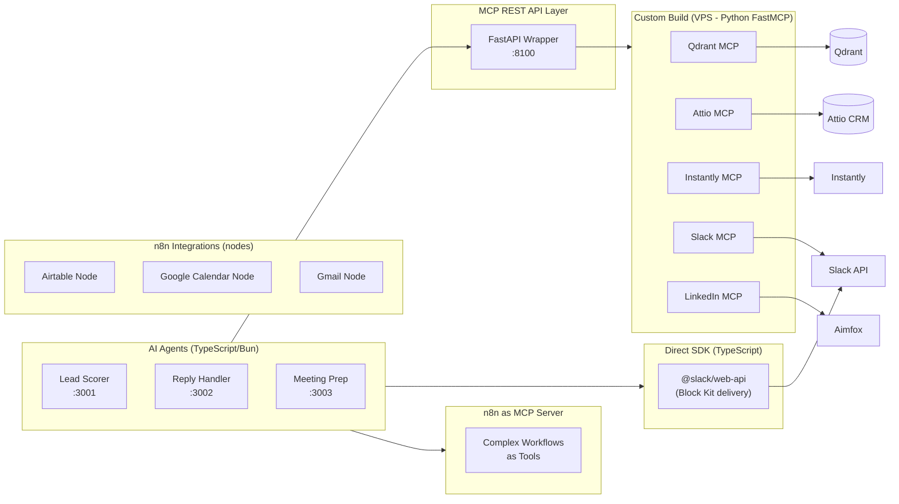

---

## Glossary

| Term | Definition |
|------|------------|
| **BANT** | Budget, Authority, Need, Timeline - framework for qualifying sales leads. Meeting Prep Agent extracts and scores these dimensions. |
| **Brain** | A vertical-specific knowledge base containing ICP rules, templates, handlers, and research. The "swappable" component that gives agents domain expertise. |
| **brain_id** | Unique identifier for a brain (format: `brain_{vertical}_{timestamp}`). MUST be included in all KB queries. |
| **Brief** | Pre-call preparation document generated by Meeting Prep Agent, delivered via Slack Block Kit. |
| **Context Gatherer** | Component that orchestrates parallel sub-agent calls to collect meeting context from multiple sources. |
| **ICP Rule** | Ideal Customer Profile scoring criterion defining an attribute, condition, and score weight. |
| **Insight** | Learning extracted from conversations, stored in KB with quality gates. |
| **Knockout Rule** | An ICP rule that, if failed, immediately disqualifies a lead (score = 0). |
| **MCP** | Model Context Protocol - standard for AI agents to interact with external tools. |
| **MCP REST API** | HTTP wrapper (:8100) that enables TypeScript agents to call Python MCP tools via REST endpoints. |
| **Brain-Scoped Query** | A query to Qdrant that includes `brain_id` filter to ensure vertical-specific results. |
| **State File** | JSON file (`state/*.json`) storing session checkpoints for resumable operations. |
| **Sub-Agent** | Pattern where main agent spawns isolated agent for data gathering (returns distilled results). |
| **Tier** | Routing classification: Tier 1 (auto-action), Tier 2 (approval needed), Tier 3 (human only). |
| **Transcript Analyzer** | Component that extracts BANT signals and generates recommendations from meeting transcripts. |
| **Vertical** | A market segment (e.g., "iro" = Investor Relations Operations, "defense" = Defense Contractors). |

---

## Change Log

| Date | Version | Changes | Author |
|------|---------|---------|--------|
| 2026-01-20 | 1.1 | Added Meeting Prep Agent flow, Agent Communication Overview, updated status tables, MCP REST API layer | Atlas GTM Team |
| 2026-01-20 | 1.0 | Initial data flow documentation with status markers | Atlas GTM Team |

---

## Maintenance Instructions

> **For Claude Code**: Follow these instructions when implementing features that affect data flow.

### When to Update This Document

1. **New agent implemented** → Add sequence diagram, update status table
2. **New MCP server added** → Update component diagram, add to MCP topology
3. **New integration point** → Update overview flow diagram
4. **Data flow changes** → Update relevant sequence diagrams

### How to Update

1. Read this document fully before making changes
2. Update the **Implementation Status** tables (top of doc)
3. Update relevant diagrams if data flow changed
4. Add entry to **Change Log** with date and description
5. Update `CLAUDE.md` status summary if component status changed

### Status Markers

- `✅` - Feature is implemented and merged to main
- `🚧` - Feature is in active development (has a branch)
- `📋` - Feature is planned but not started

---

## Next Steps

- [ ] Review with GTM expert
- [x] Add Meeting Prep agent flow ✅
- [x] Add error handling paths (Meeting Prep has retry/fallback documented) ✅
- [ ] Add monitoring/observability touchpoints
- [ ] Document retry/fallback patterns for Lead Scorer and Reply Handler

---

*For implementation details, see the specs in `/specs/` directory.*
