# Atlas GTM Data Flow Architecture

> **Last Updated**: 2026-01-22
> **Version**: 1.8
> **Status**: Active - Lead Flow (End-to-End) diagram added

---

## Table of Contents

1. [Implementation Status](#implementation-status)
2. [System Overview](#system-overview)
3. [Lead Flow (End-to-End)](#lead-flow-end-to-end)
4. [Overview Flow Diagram](#overview-flow-diagram)
5. [Agent Communication Overview](#agent-communication-overview)
6. [Lead Scorer Flow](#lead-scorer-flow)
7. [Reply Handler Flow](#reply-handler-flow)
8. [Meeting Prep Agent Flow](#meeting-prep-agent-flow)
9. [Learning Loop Agent Flow](#learning-loop-agent-flow)
10. [Brain Lifecycle Flow](#brain-lifecycle-flow)
11. [Component Architecture](#component-architecture)
12. [Glossary](#glossary)
13. [Change Log](#change-log)

---

## Implementation Status

> **Legend**: ✅ Implemented | 🚧 In Progress | 📋 Planned

### Agents

| Component | Status | Branch/PR | Notes |
|-----------|--------|-----------|-------|
| Lead Scorer Agent | ✅ | `004-lead-scorer` | Scoring, tiers, angles, Slack notifications |
| Reply Handler Agent | ✅ | `006-reply-handler-agent` | Classification, KB matching, tier routing |
| Meeting Prep Agent | ✅ | `008-meeting-prep-agent` | Pre-call briefs, post-call analysis, Slack delivery |
| Learning Loop Agent | ✅ | `010-learning-loop` | Insight extraction, quality gates, Slack validation, KB learning |

### MCP Servers

| Component | Status | Branch/PR | Notes |
|-----------|--------|-----------|-------|
| Qdrant MCP | ✅ | `002-qdrant-mcp` | KB queries, brain management |
| Brain Lifecycle | ✅ | `003-brain-lifecycle` | Create, seed, activate brains |
| Attio MCP | ✅ | `007-attio-mcp-server` | CRM operations, pipeline management |
| MCP REST API | ✅ | `008-meeting-prep-agent` | HTTP wrapper for MCP tools (:8100) |
| Dashboard API (BFF) | ✅ | `016-operator-dashboard` | Schema-first validated BFF pattern |
| Instantly MCP | ✅ | `011-instantly-mcp-upgrade` | 38 tools: campaigns, leads, emails, accounts, analytics, jobs |
| HeyReach MCP | ✅ | `012-heyreach-mcp-server` | 35 tools: campaigns, inbox, accounts, lists, leads, stats, webhooks |

### Infrastructure

| Component | Status | Branch/PR | Notes |
|-----------|--------|-----------|-------|
| Qdrant + Docker | ✅ | `001-gtm-infra` | Vector DB, 7 collections |
| n8n Workflows | ✅ | `001-gtm-infra` | Batch triggers, webhooks |
| State Management | ✅ | `004-lead-scorer` | JSON checkpoint files |

### n8n Workflow Files

| Workflow File | Agent | Trigger | Purpose |
|---------------|-------|---------|---------|
| `learning-loop-daily.json` | Learning Loop | Daily schedule | Extract insights from day's replies/transcripts |
| `learning-loop-weekly.json` | Learning Loop | Weekly schedule | Generate weekly synthesis report |
| `meeting-prep-brief.json` | Meeting Prep | Calendar webhook | Generate pre-call briefs (30 min before) |
| `meeting-prep-analysis.json` | Meeting Prep | Fireflies webhook | Post-meeting transcript analysis |
| `reply-handler-instantly.json` | Reply Handler | Instantly webhook | Process email reply notifications |
| `reply-handler-linkedin.json` | Reply Handler | HeyReach webhook | Process LinkedIn message notifications |
| `reply-classification.json` | Reply Handler | Agent callback | A/B/C category classification orchestration |
| `category-a-handler.json` | Reply Handler | Classification result | Interested leads: Attio CRM, calendar link, LinkedIn |
| `category-b-handler.json` | Reply Handler | Classification result | Not interested: stop campaigns, DNC processing |
| `category-c-handler.json` | Reply Handler | Classification result | Manual review: Slack notification, pattern storage |

> **Location**: `workflows/n8n/`

---

## System Overview

Atlas GTM is an AI-first GTM Operations System that uses swappable "brains" (vertical-specific knowledge bases) to enable rapid market validation. The core concept: **same agents, different brains** for rapid multi-vertical market validation.

### Three-System Architecture

| System | Role | Stores | Analogy |
|--------|------|--------|---------|
| **KB (Qdrant)** | System-level intelligence | ICP definitions, objection patterns, response templates, messaging insights, pattern learning | **"Brain"** |
| **Airtable** | Lead data hub | Per-lead scoring columns, enrichment data, status tracking, routing decisions | **"Hands"** |
| **Attio CRM** | Pipeline visibility | Engaged leads only (Category A), pipeline stages, deal tracking | **"Eyes"** |

**Critical Distinction**:
- **KB is NOT for**: Individual lead scoring, per-lead enrichment, lead routing decisions
- **KB IS for**: "What is our ICP definition?", "How did we handle similar objections?", "What patterns are we seeing?"

### Key Architectural Patterns

1. **Brain-Scoped Queries**: Every KB query MUST include `brain_id` filter
2. **Tier-Based Routing**: Leads/replies routed to Tier 1 (auto), Tier 2 (approval), or Tier 3 (human)
3. **MCP Tool Integration**: Agents use MCP servers for external integrations
4. **State Persistence**: Long-running operations checkpoint to state files

---

## Lead Flow (End-to-End)

This section shows the complete lead journey from source to outcome, including the three-system architecture (Hands/Brain/Eyes) and reply classification paths.

### Three-System Architecture


### Lead Flow Diagram

```mermaid
flowchart TD
    subgraph Sources["Lead Sources"]
        SRC[/"New Lead"/]
    end

    subgraph Enrichment["Enrichment & Scoring (Airtable)"]
        ENRICH["Enrichment APIs<br/>• Company size<br/>• Location/Market<br/>• Funding stage<br/>• Title/Seniority"]
        SCORE["Score Calculation<br/>icp_score = SUM(weights)<br/>is_hq_lead = score >= threshold"]
    end

    subgraph Sequences["Outreach Sequences"]
        SEQ["Start Sequences<br/>Instantly (Email)<br/>HeyReach (LinkedIn)"]
    end

    subgraph Classification["Reply Classification"]
        CLASS{{"Classify A/B/C<br/>(0.70 confidence)"}}
    end

    subgraph Categories["Category Handlers"]
        CAT_A["Category A<br/>INTERESTED"]
        CAT_B["Category B<br/>NOT INTERESTED"]
        CAT_C["Category C<br/>MANUAL REVIEW"]
    end

    subgraph Outcomes["System Updates"]
        OUT_A["• Update Airtable (replied)<br/>• Create Attio record<br/>• Send calendar link<br/>• Add to LinkedIn campaign<br/>• Slack notification<br/>• Profile enrichment"]
        OUT_B["• Update Airtable (not_interested)<br/>• Generate profile summary<br/>• Evaluate referral potential<br/>• Auto-send referral request (VP+)"]
        OUT_C["• Update Airtable (pending_review)<br/>• Store pattern to KB<br/>• Find similar patterns<br/>• Slack notification + actions"]
    end

    SRC --> ENRICH
    ENRICH --> SCORE
    SCORE --> SEQ
    SEQ -->|"Reply received"| CLASS

    CLASS -->|"Interested"| CAT_A
    CLASS -->|"Not interested"| CAT_B
    CLASS -->|"Needs review"| CAT_C

    CAT_A --> OUT_A
    CAT_B --> OUT_B
    CAT_C --> OUT_C

    OUT_A -->|"Engaged lead"| ATTIO[("Attio CRM")]
    OUT_A -->|"Status update"| AIRTABLE[("Airtable")]
    OUT_B -->|"Status + summary"| AIRTABLE
    OUT_C -->|"Pattern storage"| KB[("KB/Qdrant")]
    OUT_C -->|"Status update"| AIRTABLE

    %% Styling
    classDef source fill:#e3f2fd,stroke:#1565c0
    classDef enrich fill:#e8f5e9,stroke:#2e7d32
    classDef seq fill:#fff3e0,stroke:#e65100
    classDef classify fill:#f3e5f5,stroke:#7b1fa2
    classDef catA fill:#c8e6c9,stroke:#2e7d32
    classDef catB fill:#ffcdd2,stroke:#b71c1c
    classDef catC fill:#fff9c4,stroke:#f57f17
    classDef storage fill:#fce4ec,stroke:#880e4f

    class SRC source
    class ENRICH,SCORE enrich
    class SEQ seq
    class CLASS classify
    class CAT_A,OUT_A catA
    class CAT_B,OUT_B catB
    class CAT_C,OUT_C catC
    class ATTIO,AIRTABLE,KB storage
```



**Key Insight**: Category A is the ONLY path to Attio CRM. Categories B and C update Airtable only. Category C also writes to KB for pattern learning.

### Scoring vs Intelligence

| Aspect | Airtable (Scoring) | KB (Intelligence) |
|--------|-------------------|-------------------|
| **Scope** | Per-lead, quantitative | System-wide, qualitative |
| **Contains** | Enrichment columns, scores, routing flags | ICP definitions, patterns, templates |
| **Example** | `uk_market = +3, icp_score = 8` | "How to respond to budget objection?" |
| **Queries** | "Is this lead HQ?" | "What patterns are we seeing?" |
| **Updated by** | Enrichment APIs, Lead Scorer | Learning Loop Agent, manual seeding |

### Category Workflow Details

| Category | Trigger | Primary Actions | Secondary Actions |
|----------|---------|-----------------|-------------------|
| **A (Interested)** | positive_interest, meeting request | Attio CRM record, calendar booking link | LinkedIn campaign (email replies), Slack notification, profile enrichment |
| **B (Not Interested)** | not_interested, unsubscribe | Airtable status → not_interested | Profile summary, referral evaluation, auto-referral (VP+ polite decliners) |
| **C (Manual Review)** | unclear, low confidence (<0.70) | Airtable status → pending_review, KB pattern storage | Similar pattern search, Slack notification with context |

---

## Overview Flow Diagram

```mermaid
flowchart TB
    subgraph Entry["Entry Points"]
        WH_LS[/"Webhook: /score-lead"/]
        WH_RH[/"Webhook: /handle-reply"/]
        WH_MP[/"Webhook: /meeting-prep<br/>(brief, analyze)"/]
        WH_LL[/"Webhook: /learning-loop<br/>(extract, validate)"/]
        CAL_WH[/"Calendar Webhook<br/>(30 min before)"/]
        SLACK_CMD[/"Slack /brief Command"/]
        SLACK_VAL[/"Slack Validation<br/>Callback"/]
        N8N_SCHED[("n8n Scheduled<br/>Batch Trigger")]
        N8N_LL[("n8n Learning Loop<br/>Daily Trigger")]
        INSTANTLY[/"Instantly Email<br/>Reply Webhook"/]
    end

    subgraph Agents["AI Agents (TypeScript/Bun)"]
        LS["Lead Scorer Agent<br/>Context: 80k tokens<br/>:3001"]
        RH["Reply Handler Agent<br/>Context: 60k tokens<br/>:3002"]
        MP["Meeting Prep Agent<br/>Context: 100k tokens<br/>:3003"]
        LL["Learning Loop Agent<br/>Context: 40k tokens<br/>:3004"]
    end

    subgraph Brain["Brain System (Qdrant)"]
        BRAIN_SEL{{"Vertical Detection<br/>→ Brain Selection"}}
        KB[("Knowledge Base<br/>• ICP Rules<br/>• Templates<br/>• Objection Handlers<br/>• Market Research<br/>• Insights")]
    end

    subgraph MCPLayer["MCP Layer"]
        MCP_REST["MCP REST API<br/>:8100"]
        subgraph MCP["MCP Servers (Python FastMCP)"]
            QDRANT_MCP["Qdrant MCP"]
            ATTIO_MCP["Attio MCP"]
            INSTANTLY_MCP["Instantly MCP"]
            HEYREACH_MCP["HeyReach MCP"]
        end
    end

    subgraph External["External Systems"]
        AIRTABLE[("Airtable<br/>Lead Database")]
        ATTIO[("Attio CRM")]
        SLACK["Slack<br/>Approvals & Briefs"]
        EMAIL["Email<br/>(via Instantly)"]
        LINKEDIN["LinkedIn<br/>(via HeyReach)"]
        REDIS[("Upstash Redis<br/>Research Cache")]
        CLAUDE["Claude API"]
    end

    subgraph State["State Management"]
        STATE_FILE[/"state/*.json<br/>Session Checkpoints"/]
    end

    %% Entry to Agents
    WH_LS --> LS
    N8N_SCHED --> LS
    WH_RH --> RH
    INSTANTLY --> RH
    WH_MP --> MP
    CAL_WH --> MP
    SLACK_CMD --> MP
    WH_LL --> LL
    SLACK_VAL --> LL
    N8N_LL --> LL

    %% Agent to Brain
    LS --> BRAIN_SEL
    RH --> BRAIN_SEL
    MP --> BRAIN_SEL
    LL --> BRAIN_SEL
    BRAIN_SEL --> KB

    %% KB queries via MCP REST
    KB <-.-> MCP_REST
    MCP_REST --> QDRANT_MCP
    MCP_REST --> ATTIO_MCP
    MCP_REST --> INSTANTLY_MCP
    MCP_REST --> HEYREACH_MCP

    %% Agent to MCP REST
    LS --> MCP_REST
    RH --> MCP_REST
    MP --> MCP_REST
    LL --> MCP_REST

    %% MCP to External
    ATTIO_MCP --> ATTIO
    INSTANTLY_MCP --> EMAIL
    HEYREACH_MCP --> LINKEDIN

    %% Agent to External (direct)
    LS --> AIRTABLE
    LS --> SLACK
    RH --> AIRTABLE
    RH --> SLACK
    RH --> EMAIL
    MP --> SLACK
    MP --> REDIS
    MP --> CLAUDE
    LL --> SLACK
    LL --> REDIS
    LL --> CLAUDE

    %% State persistence
    LS --> STATE_FILE
    RH --> STATE_FILE
    MP --> STATE_FILE
    LL --> STATE_FILE

    %% Styling
    classDef entry fill:#e1f5fe,stroke:#01579b
    classDef agent fill:#fff3e0,stroke:#e65100
    classDef brain fill:#f3e5f5,stroke:#7b1fa2
    classDef mcp fill:#e8f5e9,stroke:#2e7d32
    classDef external fill:#fce4ec,stroke:#880e4f
    classDef state fill:#fffde7,stroke:#f57f17
    classDef rest fill:#bbdefb,stroke:#1976d2

    class WH_LS,WH_RH,WH_MP,WH_LL,CAL_WH,SLACK_CMD,SLACK_VAL,N8N_SCHED,N8N_LL,INSTANTLY entry
    class LS,RH,MP,LL agent
    class BRAIN_SEL,KB brain
    class QDRANT_MCP,ATTIO_MCP,INSTANTLY_MCP,HEYREACH_MCP mcp
    class MCP_REST rest
    class AIRTABLE,ATTIO,SLACK,EMAIL,LINKEDIN,REDIS,CLAUDE external
    class STATE_FILE state
```



### Data Flow Summary

| Path | Description | Volume |
|------|-------------|--------|
| Webhook → Lead Scorer → KB → Airtable/Slack | Single lead scoring | ~100-500/day |
| n8n Schedule → Lead Scorer → Batch Processing | Batch lead scoring | 50-100 per batch |
| Instantly → Reply Handler → KB → Auto/Approval/Escalate | Reply processing | 100-500 replies/day |
| Calendar → Meeting Prep → Brief → Slack | Pre-call brief generation | 5-20/day |
| Transcript → Meeting Prep → Analysis → CRM | Post-call analysis with BANT | 5-20/day |
| n8n/Webhook → Learning Loop → Extract → Quality Gates → KB | Insight extraction and learning | 50-200/day |
| Learning Loop → Slack → Human Validation → KB Write | Human-validated insights | 5-20/day |
| n8n Weekly → Learning Loop → Synthesis → Slack | Weekly synthesis reports | 1/week |

---

## Agent Communication Overview

This section shows the unified architecture across all four agents, demonstrating how they share infrastructure while maintaining distinct responsibilities.

```mermaid
flowchart TB
    subgraph Triggers["Entry Points"]
        CAL[/"Calendar Webhook<br/>(30 min before)"/]
        N8N[("n8n Scheduled")]
        N8N_LL[("n8n Learning Loop<br/>Daily/Weekly")]
        INST_WH[/"Instantly Reply<br/>Webhook"/]
        MANUAL[/"Manual /brief<br/>Slack Command"/]
        WH_SCORE[/"Score Lead<br/>Webhook"/]
        WH_LL[/"Learning Loop<br/>Webhook"/]
        SLACK_VAL[/"Slack Validation<br/>Callback"/]
    end

    subgraph Agents["AI Agents (TypeScript/Bun)"]
        LS["Lead Scorer<br/>80k tokens<br/>:3001"]
        RH["Reply Handler<br/>60k tokens<br/>:3002"]
        MP["Meeting Prep<br/>100k tokens<br/>:3003"]
        LL["Learning Loop<br/>40k tokens<br/>:3004"]
    end

    subgraph MCPLayer["MCP REST API (:8100)"]
        REST["FastAPI Wrapper"]

        subgraph Tools["MCP Tools"]
            QDRANT_T["Qdrant Tools<br/>• query_kb<br/>• get_brain<br/>• add_insight"]
            ATTIO_T["Attio Tools<br/>• find_person<br/>• update_person<br/>• create_task"]
            INST_T["Instantly Tools<br/>• 38 tools (v2 API)<br/>• campaigns, leads<br/>• emails, accounts"]
            HEYREACH_T["HeyReach Tools<br/>• 35 tools<br/>• campaigns, inbox<br/>• accounts, lists"]
        end
    end

    subgraph Data["Data Layer"]
        QDRANT[("Qdrant<br/>Vector KB<br/>:6333")]
        REDIS[("Upstash Redis<br/>Research Cache<br/>24h TTL")]
    end

    subgraph External["External Services"]
        ATTIO[("Attio CRM")]
        AIRTABLE[("Airtable")]
        SLACK["Slack<br/>Block Kit"]
        INSTANTLY["Instantly Email"]
        LINKEDIN["LinkedIn"]
        CLAUDE["Claude API"]
    end

    %% Trigger connections
    WH_SCORE --> LS
    N8N --> LS
    INST_WH --> RH
    CAL --> MP
    MANUAL --> MP
    WH_LL --> LL
    N8N_LL --> LL
    SLACK_VAL --> LL

    %% Agent to MCP REST
    LS --> REST
    RH --> REST
    MP --> REST
    LL --> REST

    %% MCP REST to Tools
    REST --> QDRANT_T
    REST --> ATTIO_T
    REST --> INST_T
    REST --> HEYREACH_T

    %% Tools to Data/External
    QDRANT_T --> QDRANT
    ATTIO_T --> ATTIO
    INST_T --> INSTANTLY
    HEYREACH_T --> LINKEDIN

    %% Direct connections
    LS --> AIRTABLE
    LS --> SLACK
    RH --> AIRTABLE
    RH --> SLACK
    MP --> SLACK
    MP --> REDIS
    MP --> CLAUDE
    LL --> SLACK
    LL --> REDIS
    LL --> CLAUDE

    %% Styling
    classDef trigger fill:#e1f5fe,stroke:#01579b
    classDef agent fill:#fff3e0,stroke:#e65100
    classDef mcp fill:#bbdefb,stroke:#1976d2
    classDef tool fill:#e8f5e9,stroke:#2e7d32
    classDef data fill:#f3e5f5,stroke:#7b1fa2
    classDef external fill:#fce4ec,stroke:#880e4f

    class CAL,N8N,N8N_LL,INST_WH,MANUAL,WH_SCORE,WH_LL,SLACK_VAL trigger
    class LS,RH,MP,LL agent
    class REST mcp
    class QDRANT_T,ATTIO_T,INST_T,HEYREACH_T tool
    class QDRANT,REDIS data
    class ATTIO,AIRTABLE,SLACK,INSTANTLY,LINKEDIN,CLAUDE external
```



### Agent Responsibilities Matrix

| Agent | Primary Function | Context Budget | Key Outputs |
|-------|-----------------|----------------|-------------|
| **Lead Scorer** | Score leads against ICP rules | 80k tokens | Score, tier, messaging angle |
| **Reply Handler** | Classify & respond to emails | 60k tokens | Auto-reply, approval request, escalation |
| **Meeting Prep** | Pre-call briefs & post-call analysis | 100k tokens | Slack brief, BANT score, CRM updates |
| **Learning Loop** | Insight extraction & KB learning | 40k tokens | Validated insights, weekly synthesis, template metrics |

### Shared Infrastructure

All agents share:
- **MCP REST API** (:8100) - HTTP wrapper for tool access
- **Qdrant KB** - Brain-scoped knowledge base queries
- **State files** - Session checkpoints for resumability
- **Slack delivery** - Consistent Block Kit formatting

---

## Lead Scorer Flow

### Sequence Diagram


### Key Components

| Component | Responsibility |
|-----------|---------------|
| **Vertical Detector** | Analyzes lead data (industry, title, tech stack) to determine vertical |
| **Brain Loader** | Retrieves active brain config for the detected vertical |
| **ICP Rule Engine** | Evaluates lead against all brain-scoped rules |
| **Tier Calculator** | Converts raw score to tier using brain thresholds |
| **Angle Recommender** | Selects messaging angle based on top signals |

### Scoring Flow Detail


---

## Reply Handler Flow

### Sequence Diagram


### Tier Routing Logic


### Intent Classification

| Intent | Description | Typical Tier |
|--------|-------------|--------------|
| `positive_interest` | Wants to learn more, schedule call | 1 |
| `question` | Asks about pricing, features, timeline | 1-2 |
| `objection` | Budget, timing, competitor concerns | 2-3 |
| `referral` | Wrong person, referring elsewhere | 1 |
| `out_of_office` | Auto-reply | Auto |
| `bounce` | Invalid email | Auto |
| `unsubscribe` | Opt out request | Auto |
| `not_interested` | Explicit rejection | Auto |
| `unclear` | Cannot determine intent | 3 |

### A/B/C Category Workflow (GTM Ops)

The Reply Handler uses an A/B/C category system for streamlined lead routing with 0.70 confidence threshold:


#### Category Definitions

| Category | Signals | Actions | Confidence |
|----------|---------|---------|------------|
| **A (Interested)** | positive_interest, meeting request, calendar request | Attio CRM record, calendar link, LinkedIn campaign | ≥ 0.70 |
| **B (Not Interested)** | not_interested, unsubscribe, out_of_office, bounce | Stop campaigns, DNC list, no further contact | ≥ 0.70 |
| **C (Manual Review)** | question, objection, referral, unclear, low confidence | Slack notification, pattern storage, human decision | < 0.70 or complex |

#### Low Confidence Routing

When classification confidence is below 0.70, the lead is routed to Category C regardless of the detected intent. This ensures human review for ambiguous cases.

---

## Meeting Prep Agent Flow

The Meeting Prep Agent generates pre-call briefs 30 minutes before scheduled meetings and performs post-call analysis on transcripts. It uses a modular sub-agent architecture for parallel data gathering.

### Brief Generation Sequence Diagram


### Post-Meeting Analysis Flow


### Brief Content Structure

The pre-call brief includes:

| Section | Content | Source |
|---------|---------|--------|
| **Lead Summary** | Name, company, role, ICP score | Airtable, Lead Scorer |
| **Conversation History** | Recent email threads, sentiment | Instantly |
| **Company Context** | Size, industry, tech stack | Attio, Research cache |
| **Similar Deals** | Past wins with similar profiles | KB (brain-scoped) |
| **Objection Prep** | Likely concerns + handler strategies | KB (brain-scoped) |
| **Suggested Agenda** | Talking points, questions to ask | Claude-generated |

### BANT Scoring

| Dimension | Weight | Signals |
|-----------|--------|---------|
| **Budget** | 25% | Explicit budget mention, funding status, org size |
| **Authority** | 25% | Decision-maker role, buying process clarity |
| **Need** | 25% | Pain point urgency, timeline pressure, current solution gaps |
| **Timeline** | 25% | Explicit dates, urgency language, project deadlines |

### Key Components

| Component | Responsibility |
|-----------|---------------|
| **Webhook Handler** | HTTP entry point, secret validation, request routing |
| **Context Gatherer** | Parallel sub-agent orchestration, cache management |
| **Brief Generator** | Claude-powered brief synthesis from gathered context |
| **Transcript Analyzer** | BANT extraction, scoring, recommendation generation |
| **Slack Delivery** | Block Kit formatting, channel routing |
| **CRM Updater** | Attio sync after analysis |

### Error Handling


---

## Learning Loop Agent Flow

The Learning Loop Agent is an automated insight extraction and KB learning system that extracts insights from email replies and call transcripts, validates them through quality gates, and writes them to the knowledge base with provenance tracking.

### Insight Extraction Pipeline


### Quality Gates Flow

```mermaid
flowchart TD
    INSIGHT[/"Extracted Insight"/] --> CONF{"Confidence<br/>≥ 0.7?"}

    CONF -->|No| REJECT_LOW["REJECT<br/>low_confidence"]
    CONF -->|Yes| DUP{"Semantic<br/>Duplicate?"}

    DUP -->|Yes| REJECT_DUP["REJECT<br/>duplicate"]
    DUP -->|No| IMP["Calculate<br/>Importance Score"]

    IMP --> ROUTE{"Route Decision"}

    ROUTE -->|"conf ≥ 0.85 AND<br/>importance ≥ 0.7"| AUTO["AUTO-APPROVE<br/>→ KB Write"]
    ROUTE -->|"conf < 0.85 OR<br/>importance ≥ 0.8"| VALIDATE["VALIDATION QUEUE<br/>→ Slack Review"]
    ROUTE -->|"importance < 0.5"| SKIP["SKIP<br/>Not significant"]

    AUTO --> WRITE["Write to KB<br/>with provenance"]
    VALIDATE --> QUEUE["Add to<br/>Validation Queue"]

    %% Styling
    classDef reject fill:#ffcdd2,stroke:#b71c1c
    classDef approve fill:#c8e6c9,stroke:#2e7d32
    classDef validate fill:#fff9c4,stroke:#f57f17
    classDef skip fill:#e0e0e0,stroke:#616161

    class REJECT_LOW,REJECT_DUP reject
    class AUTO,WRITE approve
    class VALIDATE,QUEUE validate
    class SKIP skip
```



### Validation Workflow


### Weekly Synthesis Flow


### Key Components

| Component | Responsibility | FRs |
|-----------|---------------|-----|
| **InsightExtractor** | Extract structured insights from text using Claude | FR-001 to FR-005 |
| **QualityGates** | Validate confidence, check duplicates, score importance | FR-006 to FR-010 |
| **ValidationQueue** | Slack-based human validation workflow with timeouts | FR-011 to FR-017 |
| **KBWriter** | Write validated insights to Qdrant with provenance | FR-018 to FR-021 |
| **WeeklySynthesizer** | Generate weekly trend reports and recommendations | FR-022 to FR-026 |
| **TemplateTracker** | Track response template A/B performance metrics | FR-027 to FR-032 |

### Insight Categories

| Category | Description | Auto-Approve Threshold |
|----------|-------------|------------------------|
| `objection` | New objection patterns from prospects | conf ≥ 0.85, importance ≥ 0.7 |
| `pain_point` | Pain points mentioned by prospects | conf ≥ 0.85, importance ≥ 0.7 |
| `competitor` | Competitor mentions and comparisons | conf ≥ 0.85, importance ≥ 0.6 |
| `buying_signal` | Positive buying intent signals | conf ≥ 0.90, importance ≥ 0.7 |
| `feature_request` | Feature requests from conversations | conf ≥ 0.85, importance ≥ 0.8 |
| `market_intel` | Market trends and industry insights | conf ≥ 0.80, importance ≥ 0.6 |

### State Management

The Learning Loop Agent maintains state in `state/learning-loop-state.json`:

```typescript
interface LearningLoopState {
  lastProcessedId: string;
  validationQueue: ValidationQueueItem[];
  weeklyMetrics: {
    insightsExtracted: number;
    insightsApproved: number;
    insightsRejected: number;
    templatesTracked: number;
  };
  checkpoints: {
    lastExtraction: string;
    lastValidation: string;
    lastSynthesis: string;
  };
}
```

---

## Brain Lifecycle Flow

### Sequence Diagram


### Brain State Machine


### Brain Collections Structure


---

## Component Architecture

### System Components


### MCP Server Topology

> **Decision**: Custom MCP servers over Composio - see [ADR-002](../adr/002-composio-mcp-decision.md)

```mermaid
flowchart LR
    subgraph Agents["AI Agents (TypeScript/Bun)"]
        LS["Lead Scorer<br/>:3001"]
        RH["Reply Handler<br/>:3002"]
        MP["Meeting Prep<br/>:3003"]
        LL["Learning Loop<br/>:3004"]
    end

    subgraph REST["MCP REST API Layer"]
        API["FastAPI Wrapper<br/>:8100"]
    end

    subgraph Custom["Custom Build (VPS - Python FastMCP)"]
        QD_MCP["Qdrant MCP"]
        ATTIO_MCP["Attio MCP"]
        INST_MCP["Instantly MCP"]
        SLACK_MCP["Slack MCP"]
        HEYREACH_MCP["HeyReach MCP"]
    end

    subgraph DirectSDK["Direct SDK (TypeScript)"]
        SLACK_SDK["@slack/web-api<br/>(Block Kit delivery)"]
    end

    subgraph N8N_INT["n8n Integrations (nodes)"]
        AT_N8N["Airtable Node"]
        GC_N8N["Google Calendar Node"]
        GM_N8N["Gmail Node"]
    end

    subgraph N8N_MCP["n8n as MCP Server"]
        WF_MCP["Complex Workflows<br/>as Tools"]
    end

    Agents --> API
    Agents --> DirectSDK
    Agents --> N8N_MCP
    API --> Custom

    QD_MCP --> QDRANT[("Qdrant")]
    ATTIO_MCP --> ATTIO[("Attio CRM")]
    INST_MCP --> INSTANTLY["Instantly"]
    SLACK_MCP --> SLACK["Slack API"]
    SLACK_SDK --> SLACK
    HEYREACH_MCP --> LINKEDIN["LinkedIn"]
```

---

## Glossary

| Term | Definition |
|------|------------|
| **BANT** | Budget, Authority, Need, Timeline - framework for qualifying sales leads. Meeting Prep Agent extracts and scores these dimensions. |
| **Brain** | A vertical-specific knowledge base containing ICP rules, templates, handlers, and research. The "swappable" component that gives agents domain expertise. **IMPORTANT**: Brain = KB = system-level intelligence (NOT lead-level operations). Stores "what we know" not "per-lead data". |
| **brain_id** | Unique identifier for a brain (format: `brain_{vertical}_{timestamp}`). MUST be included in all KB queries. |
| **Brief** | Pre-call preparation document generated by Meeting Prep Agent, delivered via Slack Block Kit. |
| **Context Gatherer** | Component that orchestrates parallel sub-agent calls to collect meeting context from multiple sources. |
| **ICP Rule** | Ideal Customer Profile scoring criterion defining an attribute, condition, and score weight. |
| **Insight** | Learning extracted from conversations, stored in KB with provenance tracking. Learning Loop Agent extracts and validates insights before KB write. |
| **Knockout Rule** | An ICP rule that, if failed, immediately disqualifies a lead (score = 0). |
| **Learning Loop** | Automated system for extracting insights from conversations, validating through quality gates, and writing to KB. Includes weekly synthesis reports. |
| **MCP** | Model Context Protocol - standard for AI agents to interact with external tools. |
| **MCP REST API** | HTTP wrapper (:8100) that enables TypeScript agents to call Python MCP tools via REST endpoints. |
| **Brain-Scoped Query** | A query to Qdrant that includes `brain_id` filter to ensure vertical-specific results. |
| **Quality Gate** | Validation checkpoint in Learning Loop: confidence threshold (≥0.7), duplicate detection (semantic similarity >0.95), importance scoring. |
| **State File** | JSON file (`state/*.json`) storing session checkpoints for resumable operations. |
| **Sub-Agent** | Pattern where main agent spawns isolated agent for data gathering (returns distilled results). |
| **Template Tracking** | A/B performance metrics for response templates. Learning Loop tracks reply rates, conversion, and sentiment by template. |
| **Tier** | Routing classification: Tier 1 (auto-action), Tier 2 (approval needed), Tier 3 (human only). |
| **Transcript Analyzer** | Component that extracts BANT signals and generates recommendations from meeting transcripts. |
| **Validation Queue** | Slack-based workflow for human validation of low-confidence or high-importance insights. 48h timeout with reminder. |
| **Vertical** | A market segment (e.g., "iro" = Investor Relations Operations, "defense" = Defense Contractors). |
| **Weekly Synthesis** | Learning Loop report summarizing week's insights, trends, and template performance. Delivered via Slack. |

---

## Change Log

| Date | Version | Changes | Author |
|------|---------|---------|--------|
| 2026-01-22 | 1.8 | Added Lead Flow (End-to-End) section with Three-System Architecture diagram (Hands/Brain/Eyes), comprehensive lead flow diagram showing enrichment → scoring → sequences → classification → category outcomes, Scoring vs Intelligence table, and Category Workflow Details table. Verified against actual code (category-a/b/c.ts). | Atlas GTM Team |
| 2026-01-22 | 1.7 | Added A/B/C category workflow for GTM Ops (0.70 confidence threshold). Added 4 new n8n workflows (reply-classification, category-a/b/c handlers). Updated Reply Handler Flow section with category routing diagram. | Atlas GTM Team |
| 2026-01-21 | 1.6 | Added Three-System Architecture section clarifying KB=Brain=system-level intelligence (NOT lead-level). Updated glossary. | Atlas GTM Team |
| 2026-01-21 | 1.5 | Added n8n workflow files reference table (6 workflows for learning loop, meeting prep, reply handler) | Atlas GTM Team |
| 2026-01-21 | 1.4 | Added HeyReach MCP status ✅ (35 tools: campaigns, inbox, accounts, lists, leads, stats, webhooks) | Atlas GTM Team |
| 2026-01-21 | 1.3 | Updated Instantly MCP status to ✅ complete (38 tools via v2 API: campaigns, leads, emails, accounts, analytics, jobs) | Atlas GTM Team |
| 2026-01-20 | 1.2 | Added Learning Loop Agent flow (insight extraction, quality gates, validation workflow, weekly synthesis), updated overview diagrams, glossary terms | Atlas GTM Team |
| 2026-01-20 | 1.1 | Added Meeting Prep Agent flow, Agent Communication Overview, updated status tables, MCP REST API layer | Atlas GTM Team |
| 2026-01-20 | 1.0 | Initial data flow documentation with status markers | Atlas GTM Team |

---

## Maintenance Instructions

> **For Claude Code**: Follow these instructions when implementing features that affect data flow.

### When to Update This Document

1. **New agent implemented** → Add sequence diagram, update status table
2. **New MCP server added** → Update component diagram, add to MCP topology
3. **New integration point** → Update overview flow diagram
4. **Data flow changes** → Update relevant sequence diagrams

### How to Update

1. Read this document fully before making changes
2. Update the **Implementation Status** tables (top of doc)
3. Update relevant diagrams if data flow changed
4. Add entry to **Change Log** with date and description
5. Update `CLAUDE.md` status summary if component status changed

### Status Markers

- `✅` - Feature is implemented and merged to main
- `🚧` - Feature is in active development (has a branch)
- `📋` - Feature is planned but not started

---

## Next Steps

- [ ] Review with GTM expert
- [x] Add Meeting Prep agent flow ✅
- [x] Add error handling paths (Meeting Prep has retry/fallback documented) ✅
- [ ] Add monitoring/observability touchpoints
- [ ] Document retry/fallback patterns for Lead Scorer and Reply Handler

---

## Related Documentation

- [Data Contracts Architecture](./data-contracts.md) - Schema-first validation pattern for Dashboard API
- [Knowledge Base Spec](../../specs/knowledge-base.md) - KB design decisions

*For implementation details, see the specs in `/specs/` directory.*
