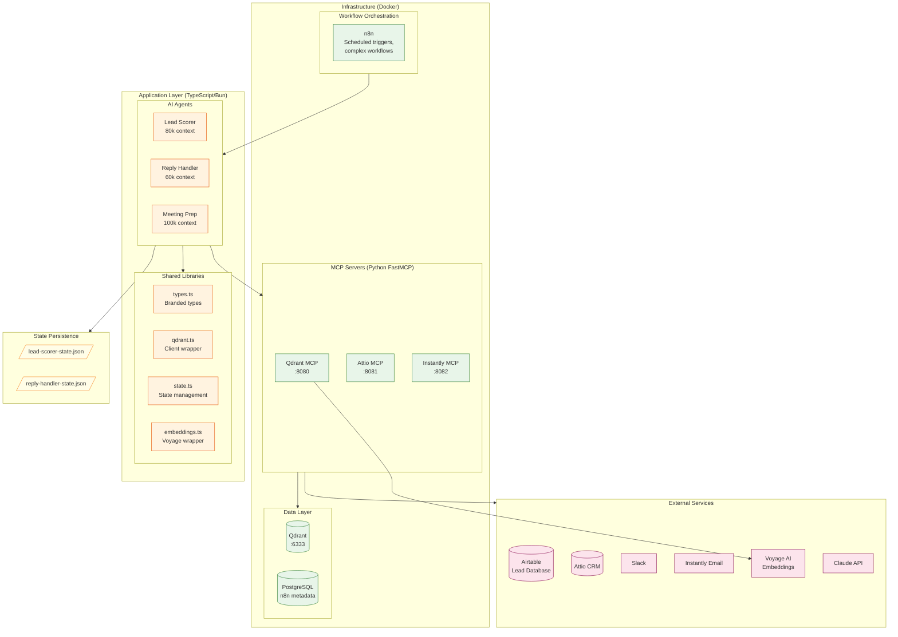
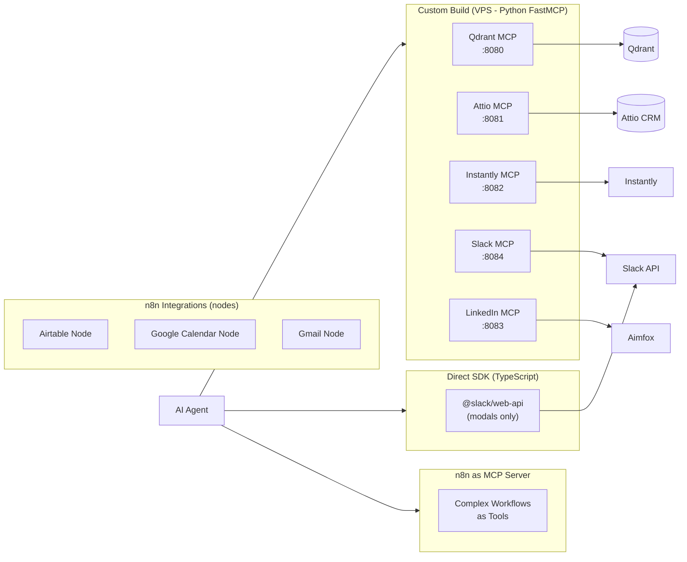

# Atlas GTM Data Flow Architecture

> **Last Updated**: 2026-01-20
> **Version**: 1.0
> **Status**: Draft - Iterating with GTM expert

---

## Table of Contents

1. [Implementation Status](#implementation-status)
2. [System Overview](#system-overview)
3. [Overview Flow Diagram](#overview-flow-diagram)
4. [Lead Scorer Flow](#lead-scorer-flow)
5. [Reply Handler Flow](#reply-handler-flow)
6. [Brain Lifecycle Flow](#brain-lifecycle-flow)
7. [Component Architecture](#component-architecture)
8. [Glossary](#glossary)
9. [Change Log](#change-log)

---

## Implementation Status

> **Legend**: ✅ Implemented | 🚧 In Progress | 📋 Planned

### Agents

| Component | Status | Branch/PR | Notes |
|-----------|--------|-----------|-------|
| Lead Scorer Agent | ✅ | `004-lead-scorer` | Scoring, tiers, angles, Slack notifications |
| Reply Handler Agent | ✅ | `006-reply-handler-agent` | Classification, KB matching, tier routing |
| Meeting Prep Agent | 📋 | - | Pre-call briefs, context gathering |

### MCP Servers

| Component | Status | Branch/PR | Notes |
|-----------|--------|-----------|-------|
| Qdrant MCP | ✅ | `002-qdrant-mcp` | KB queries, brain management |
| Brain Lifecycle | ✅ | `003-brain-lifecycle` | Create, seed, activate brains |
| Attio MCP | 🚧 | `007-attio-mcp-server` | CRM operations |
| Instantly MCP | 📋 | - | Email campaign integration |
| LinkedIn MCP | 📋 | - | LinkedIn automation |

### Infrastructure

| Component | Status | Branch/PR | Notes |
|-----------|--------|-----------|-------|
| Qdrant + Docker | ✅ | `001-gtm-infra` | Vector DB, 7 collections |
| n8n Workflows | ✅ | `001-gtm-infra` | Batch triggers, webhooks |
| State Management | ✅ | `004-lead-scorer` | JSON checkpoint files |

---

## System Overview

Atlas GTM is an AI-first GTM Operations System that uses swappable "brains" (vertical-specific knowledge bases) to enable rapid market validation. The core concept: **same agents, different brains** for rapid multi-vertical market validation.

### Key Architectural Patterns

1. **Brain-Scoped Queries**: Every KB query MUST include `brain_id` filter
2. **Tier-Based Routing**: Leads/replies routed to Tier 1 (auto), Tier 2 (approval), or Tier 3 (human)
3. **MCP Tool Integration**: Agents use MCP servers for external integrations
4. **State Persistence**: Long-running operations checkpoint to state files

---

## Overview Flow Diagram

```mermaid
flowchart TB
    subgraph Entry["Entry Points"]
        WH_LS[/"Webhook: /score-lead"/]
        WH_RH[/"Webhook: /handle-reply"/]
        N8N_SCHED[("n8n Scheduled<br/>Batch Trigger")]
        INSTANTLY[/"Instantly Email<br/>Reply Webhook"/]
    end

    subgraph Agents["AI Agents (TypeScript)"]
        LS["Lead Scorer Agent<br/>Context: 80k tokens"]
        RH["Reply Handler Agent<br/>Context: 60k tokens"]
    end

    subgraph Brain["Brain System (Qdrant)"]
        BRAIN_SEL{{"Vertical Detection<br/>→ Brain Selection"}}
        KB[("Knowledge Base<br/>• ICP Rules<br/>• Templates<br/>• Objection Handlers<br/>• Market Research<br/>• Insights")]
    end

    subgraph MCP["MCP Servers (Python FastMCP)"]
        QDRANT_MCP["Qdrant MCP<br/>:8080"]
        ATTIO_MCP["Attio MCP<br/>:8081"]
        INSTANTLY_MCP["Instantly MCP<br/>:8082"]
    end

    subgraph External["External Systems"]
        AIRTABLE[("Airtable<br/>Lead Database")]
        ATTIO[("Attio CRM")]
        SLACK["Slack<br/>Approvals & Alerts"]
        EMAIL["Email<br/>(via Instantly)"]
    end

    subgraph State["State Management"]
        STATE_FILE[/"state/*.json<br/>Session Checkpoints"/]
    end

    %% Entry to Agents
    WH_LS --> LS
    N8N_SCHED --> LS
    WH_RH --> RH
    INSTANTLY --> RH

    %% Agent to Brain
    LS --> BRAIN_SEL
    RH --> BRAIN_SEL
    BRAIN_SEL --> KB

    %% KB queries via MCP
    KB <-.-> QDRANT_MCP

    %% Agent to MCP
    LS --> QDRANT_MCP
    LS --> ATTIO_MCP
    RH --> QDRANT_MCP
    RH --> ATTIO_MCP
    RH --> INSTANTLY_MCP

    %% MCP to External
    ATTIO_MCP --> ATTIO
    INSTANTLY_MCP --> EMAIL

    %% Agent to External (via n8n)
    LS --> AIRTABLE
    LS --> SLACK
    RH --> AIRTABLE
    RH --> SLACK
    RH --> EMAIL

    %% State persistence
    LS --> STATE_FILE
    RH --> STATE_FILE

    %% Styling
    classDef entry fill:#e1f5fe,stroke:#01579b
    classDef agent fill:#fff3e0,stroke:#e65100
    classDef brain fill:#f3e5f5,stroke:#7b1fa2
    classDef mcp fill:#e8f5e9,stroke:#2e7d32
    classDef external fill:#fce4ec,stroke:#880e4f
    classDef state fill:#fffde7,stroke:#f57f17

    class WH_LS,WH_RH,N8N_SCHED,INSTANTLY entry
    class LS,RH agent
    class BRAIN_SEL,KB brain
    class QDRANT_MCP,ATTIO_MCP,INSTANTLY_MCP mcp
    class AIRTABLE,ATTIO,SLACK,EMAIL external
    class STATE_FILE state
```

### Data Flow Summary

| Path | Description | Volume |
|------|-------------|--------|
| Webhook → Lead Scorer → KB → Airtable/Slack | Single lead scoring | ~100-500/day |
| n8n Schedule → Lead Scorer → Batch Processing | Batch lead scoring | 50-100 per batch |
| Instantly → Reply Handler → KB → Auto/Approval/Escalate | Reply processing | 100-500 replies/day |

---

## Lead Scorer Flow

### Sequence Diagram

### Key Components

| Component | Responsibility |
|-----------|---------------|
| **Vertical Detector** | Analyzes lead data (industry, title, tech stack) to determine vertical |
| **Brain Loader** | Retrieves active brain config for the detected vertical |
| **ICP Rule Engine** | Evaluates lead against all brain-scoped rules |
| **Tier Calculator** | Converts raw score to tier using brain thresholds |
| **Angle Recommender** | Selects messaging angle based on top signals |

### Scoring Flow Detail

---

## Reply Handler Flow

### Sequence Diagram

### Tier Routing Logic

### Intent Classification

| Intent | Description | Typical Tier |
|--------|-------------|--------------|
| `positive_interest` | Wants to learn more, schedule call | 1 |
| `question` | Asks about pricing, features, timeline | 1-2 |
| `objection` | Budget, timing, competitor concerns | 2-3 |
| `referral` | Wrong person, referring elsewhere | 1 |
| `out_of_office` | Auto-reply | Auto |
| `bounce` | Invalid email | Auto |
| `unsubscribe` | Opt out request | Auto |
| `not_interested` | Explicit rejection | Auto |
| `unclear` | Cannot determine intent | 3 |

---

## Brain Lifecycle Flow

### Sequence Diagram

### Brain State Machine

### Brain Collections Structure

---

## Component Architecture

### System Components

### MCP Server Topology

> **Decision**: Custom MCP servers over Composio - see [ADR-002](../adr/002-composio-mcp-decision.md)

---

## Glossary

| Term | Definition |
|------|------------|
| **Brain** | A vertical-specific knowledge base containing ICP rules, templates, handlers, and research. The "swappable" component that gives agents domain expertise. |
| **brain_id** | Unique identifier for a brain (format: `brain_{vertical}_{timestamp}`). MUST be included in all KB queries. |
| **Vertical** | A market segment (e.g., "iro" = Investor Relations Operations, "defense" = Defense Contractors). |
| **Tier** | Routing classification: Tier 1 (auto-action), Tier 2 (approval needed), Tier 3 (human only). |
| **ICP Rule** | Ideal Customer Profile scoring criterion defining an attribute, condition, and score weight. |
| **MCP** | Model Context Protocol - standard for AI agents to interact with external tools. |
| **Knockout Rule** | An ICP rule that, if failed, immediately disqualifies a lead (score = 0). |
| **Brain-Scoped Query** | A query to Qdrant that includes `brain_id` filter to ensure vertical-specific results. |
| **State File** | JSON file (`state/*.json`) storing session checkpoints for resumable operations. |
| **Sub-Agent** | Pattern where main agent spawns isolated agent for data gathering (returns distilled results). |
| **Insight** | Learning extracted from conversations, stored in KB with quality gates. |

---

## Change Log

| Date | Version | Changes | Author |
|------|---------|---------|--------|
| 2026-01-20 | 1.0 | Initial data flow documentation with status markers | Atlas GTM Team |

---

## Maintenance Instructions

> **For Claude Code**: Follow these instructions when implementing features that affect data flow.

### When to Update This Document

1. **New agent implemented** → Add sequence diagram, update status table
2. **New MCP server added** → Update component diagram, add to MCP topology
3. **New integration point** → Update overview flow diagram
4. **Data flow changes** → Update relevant sequence diagrams

### How to Update

1. Read this document fully before making changes
2. Update the **Implementation Status** tables (top of doc)
3. Update relevant diagrams if data flow changed
4. Add entry to **Change Log** with date and description
5. Update `CLAUDE.md` status summary if component status changed

### Status Markers

- `✅` - Feature is implemented and merged to main
- `🚧` - Feature is in active development (has a branch)
- `📋` - Feature is planned but not started

---

## Next Steps

- [ ] Review with GTM expert
- [ ] Add Meeting Prep agent flow (when implemented)
- [ ] Add error handling paths
- [ ] Add monitoring/observability touchpoints
- [ ] Document retry/fallback patterns

---

*For implementation details, see the specs in `/specs/` directory.*
