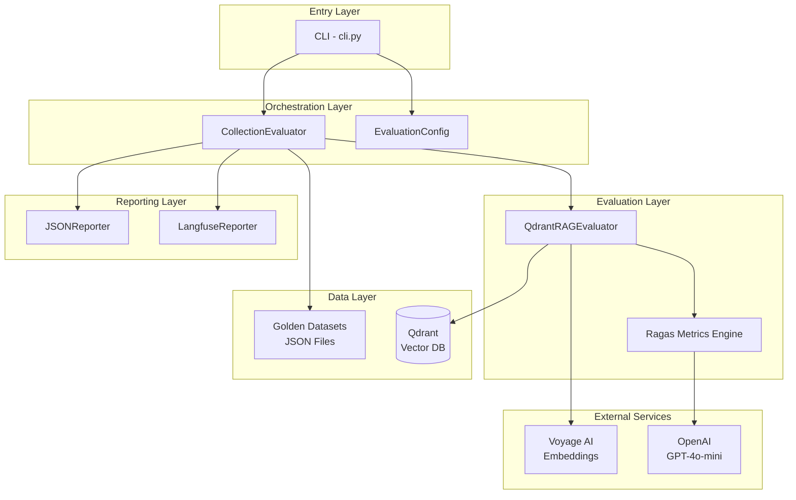
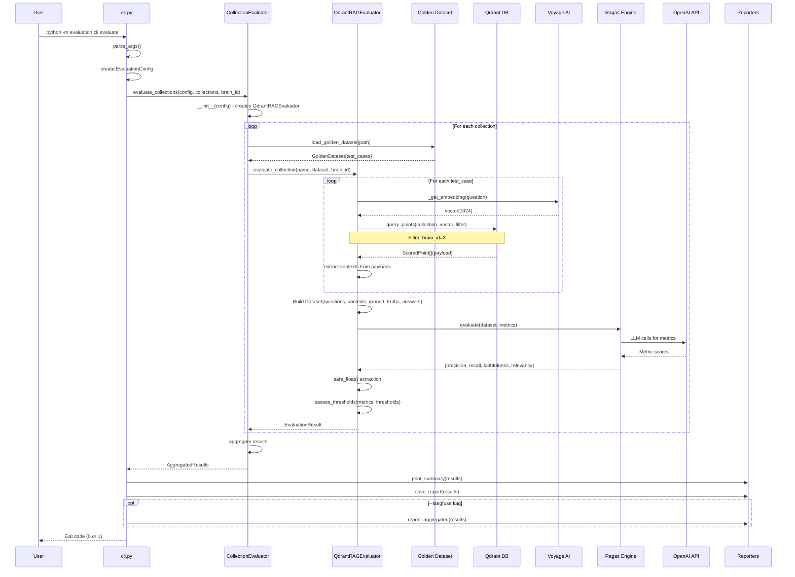
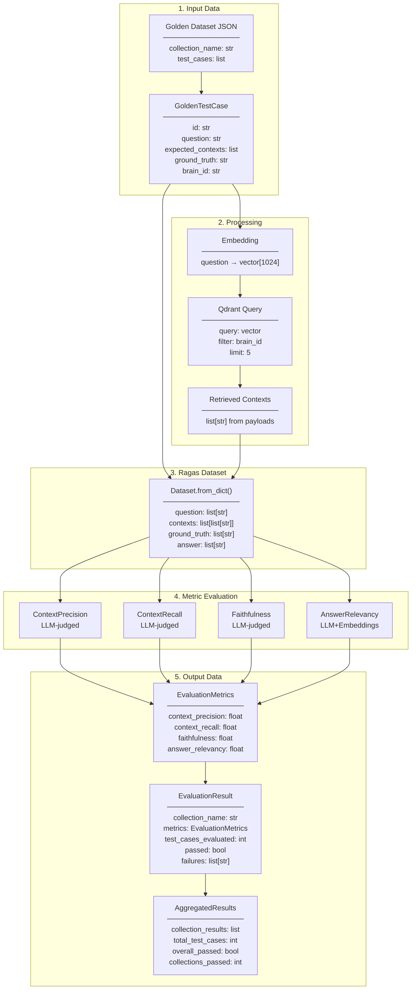
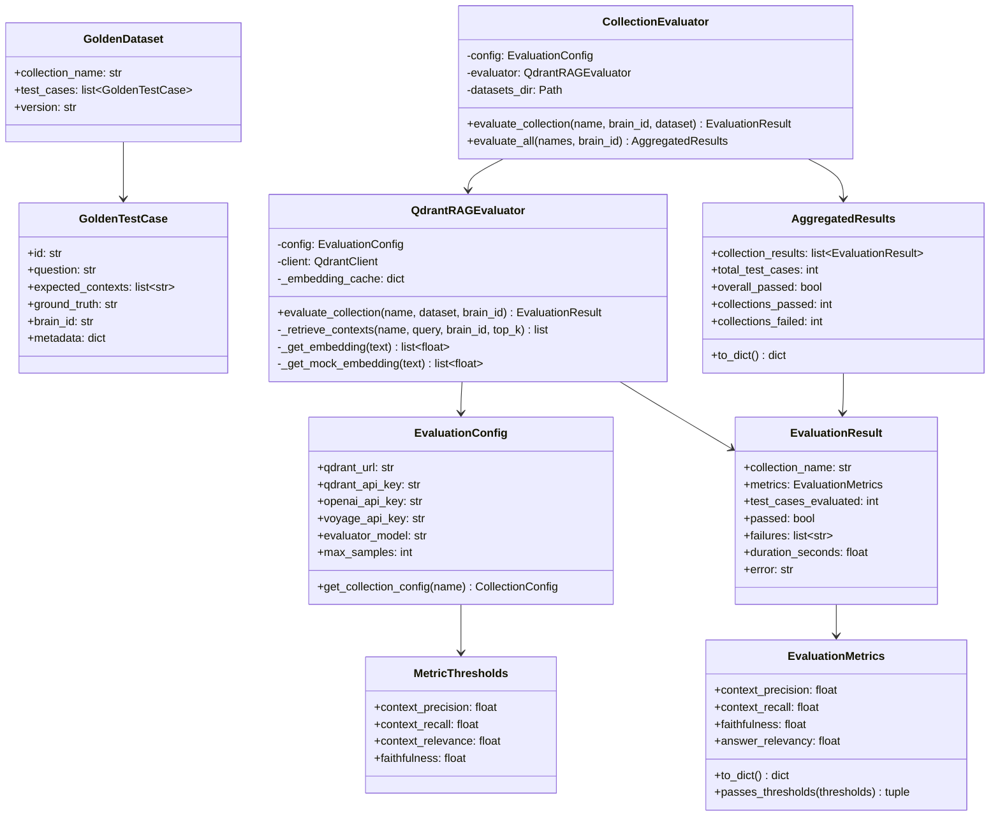
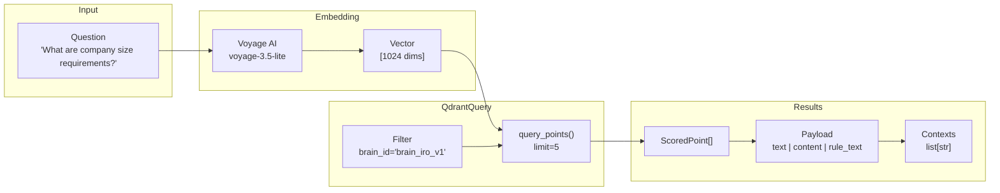
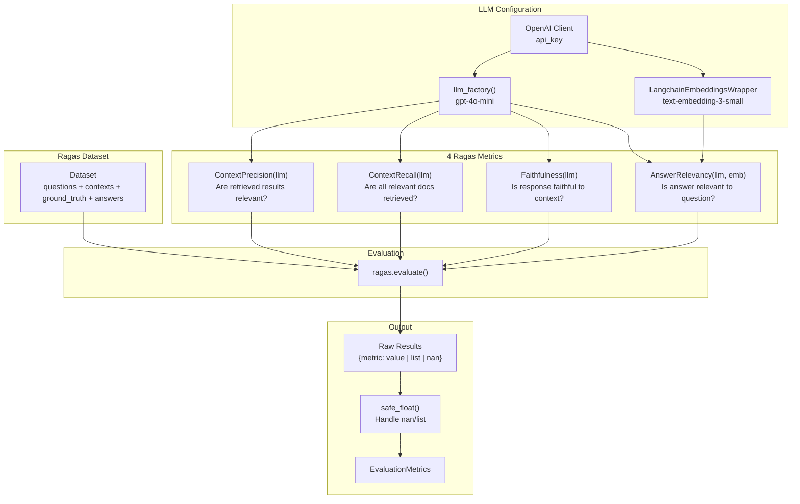
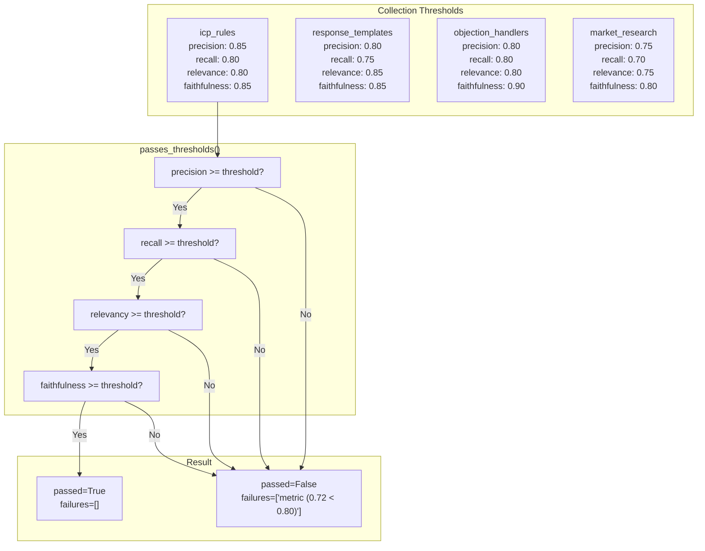

# RAG Evaluation System - Data Flow & Execution Analysis

## Overview

This document provides a surgical analysis of the RAG evaluation system in Atlas GTM, including data flow, execution flow, and code architecture using Mermaid diagrams.

---

## 1. High-Level Architecture



---

## 2. Execution Flow (Sequence Diagram)



---

## 3. Data Flow Diagram



---

## 4. Component Class Diagram



---

## 5. Context Retrieval Detail



---

## 6. Ragas Metrics Pipeline



---

## 7. Threshold Validation Flow



---

## 8. File Structure

```
mcp-servers/atlas_gtm_mcp/evaluation/
├── __init__.py
├── config.py                    # EvaluationConfig, MetricThresholds, COLLECTION_THRESHOLDS
├── cli.py                       # Entry point: main(), run_evaluation(), create_parser()
├── seed_test_data.py            # Seeds Qdrant with test data for CI
│
├── datasets/
│   ├── __init__.py
│   ├── loader.py                # GoldenTestCase, GoldenDataset, load_golden_dataset()
│   ├── icp_rules_golden.json    # Test cases for ICP rules
│   ├── response_templates_golden.json
│   ├── objection_handlers_golden.json
│   └── market_research_golden.json
│
├── evaluators/
│   ├── __init__.py
│   ├── qdrant_evaluator.py      # QdrantRAGEvaluator, EvaluationMetrics, EvaluationResult
│   └── collection_evaluator.py  # CollectionEvaluator, AggregatedResults
│
└── reporters/
    ├── __init__.py
    ├── json_reporter.py         # JSONReporter: save_report(), print_summary()
    └── langfuse_reporter.py     # LangfuseReporter: report_aggregated()
```

---

## 9. Key Code Paths

### CLI Entry → Evaluation
```
cli.py:main()
  ├─ create_parser() → argparse setup
  ├─ parse_args()
  └─ asyncio.run(run_evaluation(args))
        ├─ EvaluationConfig(qdrant_url, max_samples)
        └─ evaluate_collections(config, collections, brain_id)
              └─ CollectionEvaluator(config).evaluate_all()
```

### Per-Collection Evaluation
```
CollectionEvaluator.evaluate_all()
  └─ for collection in collections:
        evaluate_collection(name, brain_id)
          ├─ load_golden_dataset(path) → GoldenDataset
          └─ QdrantRAGEvaluator.evaluate_collection()
                ├─ for test_case in dataset:
                │     _retrieve_contexts()
                │       ├─ _get_embedding(question) → vector
                │       └─ client.query_points() → contexts
                ├─ Dataset.from_dict({questions, contexts, ground_truths, answers})
                ├─ ragas.evaluate(dataset, metrics)
                ├─ safe_float() extraction
                └─ passes_thresholds() → EvaluationResult
```

### Reporting
```
run_evaluation()
  ├─ JSONReporter.print_summary(results)
  ├─ JSONReporter.save_report(results) → JSON file
  └─ LangfuseReporter.report_aggregated(results) → Langfuse traces
```

---

## 10. Critical Implementation Details

### Brain-Scoped Queries (Multi-Tenant Isolation)
Every Qdrant query includes `brain_id` filter:
```python
# qdrant_evaluator.py:296-304
if brain_id:
    filter_conditions = Filter(
        must=[FieldCondition(
            key="brain_id",
            match=MatchValue(value=brain_id),
        )]
    )
```

### Mock Embeddings for CI
Deterministic 1024-dim vectors based on SHA256:
```python
# qdrant_evaluator.py:373-400
if os.getenv("CI") or os.getenv("USE_MOCK_EMBEDDINGS"):
    embedding = self._get_mock_embedding(text)  # SHA256-based
```

### Safe Float Extraction
Handles nan and list values from Ragas:
```python
# qdrant_evaluator.py:216-224
def safe_float(value, default=0.0):
    if isinstance(value, list):
        value = value[0] if value else default
    result = float(value)
    return default if math.isnan(result) else result
```

---

## Quick Reference

### CLI Usage

```bash
# Evaluate all collections
python -m atlas_gtm_mcp.evaluation.cli evaluate

# Evaluate specific collection
python -m atlas_gtm_mcp.evaluation.cli evaluate --collection icp_rules

# Evaluate with brain filter
python -m atlas_gtm_mcp.evaluation.cli evaluate --brain-id brain_iro_v1

# Save report and send to Langfuse
python -m atlas_gtm_mcp.evaluation.cli evaluate --output ./reports --langfuse

# Limit samples for quick testing
python -m atlas_gtm_mcp.evaluation.cli evaluate --max-samples 5

# List available datasets
python -m atlas_gtm_mcp.evaluation.cli list
```

### Seed Test Data for CI

```bash
# Set environment variable to use mock embeddings
export USE_MOCK_EMBEDDINGS=true

# Run seeding script
python -m atlas_gtm_mcp.evaluation.seed_test_data
```

---

## Summary

The RAG evaluation system follows a clean layered architecture:

1. **CLI Layer** - Parses args, creates config, invokes evaluation
2. **Orchestration Layer** - `CollectionEvaluator` manages batch evaluation
3. **Evaluation Layer** - `QdrantRAGEvaluator` queries Qdrant, runs Ragas metrics
4. **Data Layer** - Golden datasets (JSON) and Qdrant collections
5. **Reporting Layer** - JSON files and Langfuse integration

Key flows:
- Questions → Voyage AI embeddings → Qdrant vector search → Contexts
- Contexts + Ground Truth → Ragas metrics → Pass/Fail determination
- Results aggregated across collections → Reports generated
